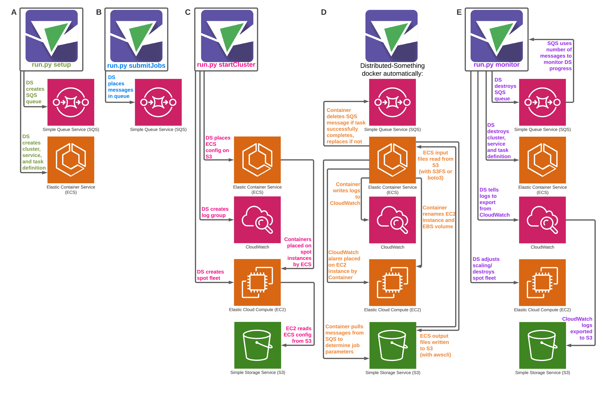

# Distributed-Something
Run encapsulated docker containers that do... something in the Amazon Web Services (AWS) infrastructure.
We are interested in scientific image analysis so we have used it for [CellProfiler](https://github.com/CellProfiler/Distributed-CellProfiler), [Fiji](https://github.com/CellProfiler/Distributed-Fiji), and [BioFormats2Raw](https://github.com/CellProfiler/Distributed-OmeZarrMaker).
You can use it for whatever you want!

## Documentation
Full documentation is available on our [Documentation Website](https://distributedscience.github.io/Distributed-Something).

## Overview

This code is an example of how to use AWS distributed infrastructure for running anything Dockerized.
The configuration of the AWS resources is done using boto3 and the AWS CLI.
The worker is written in Python and is encapsulated in a Docker container.
There are four AWS components that are minimally needed to run distributed jobs:

1. An SQS queue
2. An ECS cluster
3. An S3 bucket
4. A spot fleet of EC2 instances

All of them can be managed individually through the AWS Management Console.
However, this code helps to get started quickly and run a job autonomously if all the configuration is correct.
The code runs a script that links all these components and prepares the infrastructure to run a distributed job.
When the job is completed, the code is also able to stop resources and clean up components.
It also adds logging and alarms via CloudWatch, helping the user troubleshoot runs and destroy stuck machines.

## Running the code

### Step 1
Edit the config.py file with all the relevant information for your job.
Then, start creating the basic AWS resources by running the following script:

 $ python3 run.py setup

This script initializes the resources in AWS.
Notice that the docker registry is built separately and you can modify the worker code to build your own.
Any time you modify the worker code, you need to update the docker registry using the Makefile script inside the worker directory.

### Step 2
After the first script runs successfully, the job can now be submitted to with the following command:

 $ python3 run.py submitJob files/exampleJob.json

Running the script uploads the tasks that are configured in the json file.  
You have to customize the exampleJob.json file with information that make sense for your project.
You'll want to figure out which information is generic and which is the information that makes each job unique.

### Step 3
After submitting the job to the queue, we can add computing power to process all tasks in AWS.
This code starts a fleet of spot EC2 instances which will run the worker code.
The worker code is encapsulated in Docker containers, and the code uses ECS services to inject them in EC2.
All this is automated with the following command:

 $ python3 run.py startCluster files/exampleFleet.json

After the cluster is ready, the code informs you that everything is setup, and saves the spot fleet identifier in a file for further reference.

### Step 4
When the cluster is up and running, you can monitor progress using the following command:

 $ python3 run.py monitor files/APP_NAMESpotFleetRequestId.json

The file APP_NAMESpotFleetRequestId.json is created after the cluster is setup in step 3.
It is important to keep this monitor running if you want to automatically shutdown computing resources when there are no more tasks in the queue (recommended).

See our [full documentation](https://distributedscience.github.io/Distributed-Something) for more information about each step of the process.

