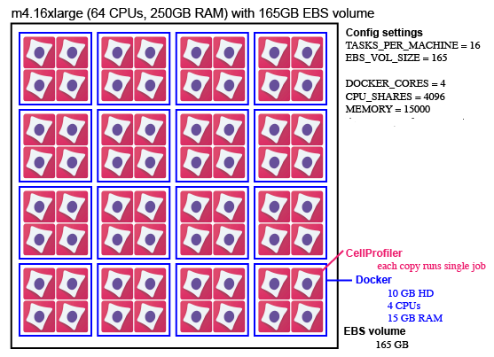

# What is Distributed-Something?

Distributed-Something is a series of scripts designed to help you run a Dockerized version of your software on [Amazon Web Services](https://aws.amazon.com/) (AWS) using AWS's file storage and cloud computing systems.

Distributed-Something:
* simplifies the process of distributing and running software in the cloud.
* decreases the cost of cloud computing by optimizing resources used.
* makes workflows reproducible.
* is Python based which makes it broadly accessible to novice computationalists.

You will need to customize Distributed-Something for your particular use case.
See [Customizing Distributed-Something](customizing_DS.md) for customization details.

## What is Docker?

Docker is a software platform that packages software into containers.
In a container is the software that you want to run as well as everything needed to run it (e.g. your software source code, operating system libraries, and dependencies).

Dockerizing a workflow has many benefits including
* Ease of use: Dockerized software doesn't require the user to install anything themselves.
* Reproducibility: You don't need to worry about results being affected by the version of your software or its dependencies being used as those are fixed.

## Why would I want to use this?

Using AWS allows you to create a flexible, on-demand computing infrastructure where you only have to pay for the resources you use.
This can give you access to far more computing power than you may have available at your home institution, which is great when you have large datasets to process.

Each piece of the infrastructure has to be added and configured separately, which can be time-consuming and confusing.

Distributed-Something tries to leverage the power of the former, while minimizing the problems of the latter.

## What do I need to have to run this?

Essentially all you need to run Distributed-Something is an AWS account and a terminal program; see our [page on getting set up](step_0_prep.md) for all the specific steps you'll need to take.
You will also need a Dockerized version of your software.

## What happens in AWS when I run Distributed-Something?

The steps for actually running the Distributed-Something code are outlined in the repository [README](https://github.com/DistributedScience/Distributed-Something/blob/master/README.md), and details of the parameters you set in each step are on their respective Documentation pages ([Step 1: Config](step_1_configuration.md), [Step 2: Jobs](step_2_submit_jobs.md), [Step 3: Fleet](step_3_start_cluster.md), and optional [Step 4: Monitor](step_4_monitor.md)).
We'll give an overview of what happens in AWS at each step here and explain what AWS does automatically once you have it set up.

**Step 1**:
In the Config file you set quite a number of specifics that are used by EC2, ECS, SQS, and in making Dockers.
When you run `$ python3 run.py setup` to execute the Config, it does three major things:
* Creates task definitions.
These are found in ECS.
They define the configuration of the Dockers and include the settings you gave for **CHECK_IF_DONE_BOOL**, **DOCKER_CORES**, **EXPECTED_NUMBER_FILES**, and **MEMORY**.
* Makes a queue in SQS (it is empty at this point) and sets a dead-letter queue.
* Makes a service in ECS which defines how many Dockers you want.

**Step 2**:
In the Job file you set the location of any inputs (e.g. data and batch-specific scripts) and outputs.
Additionally, you list all of the individual tasks that you want run.
When you submit the Job file it adds that list of tasks to the queue in SQS (which you made in the previous step).
Submit jobs with `$ python3 run.py submitJob`.

**Step 3**:
In the Config file you set the number and size of the EC2 instances you want.
This information, along with account-specific configuration in the Fleet file is used to start the fleet with `$ python3 run.py startCluster`.

**After these steps are complete, a number of things happen automatically**:
* ECS puts Docker containers onto EC2 instances.
If there is a mismatch within your Config file and the Docker is larger than the instance it will not be placed.
ECS will keep placing Dockers onto an instance until it is full, so if you accidentally create instances that are too large you may end up with more Dockers placed on it than intended.
This is also why you may want multiple **ECS_CLUSTER**s so that ECS doesn't blindly place Dockers you intended for one job onto an instance you intended for another job.
* When a Docker container gets placed it gives the instance it's on its own name.
* Once an instance has a name, the Docker gives it an alarm that tells it to reboot if it is sitting idle for 15 minutes.
* The Docker hooks the instance up to the _perinstance logs in CloudWatch.
* The instances look in SQS for a job.
Any time they don't have a job they go back to SQS.
If SQS tells them there are no visible jobs then they shut themselves down.
* When an instance finishes a job it sends a message to SQS and removes that job from the queue.

## What does this look like?

This is an example of one possible instance configuration using [Distributed-CellProfiler](http://github.com/cellprofiler/distributed-cellprofiler) as an example.
This is one m4.16xlarge EC2 instance (64 CPUs, 250GB of RAM) with a 165 EBS volume mounted on it. A spot fleet could contain many such instances.
It has 16 tasks (individual Docker containers).
Each Docker container uses 10GB of hard disk space and is assigned 4 CPUs and 15 GB of RAM (which it does not share with other Docker containers).
Each container shares its individual resources among 4 copies of CellProfiler.
Each copy of CellProfiler runs a pipeline on one "job", which can be anything from a single image to an entire 384 well plate or timelapse movie.
You can optionally stagger the start time of these 4 copies of CellProfiler, ensuring that the most memory- or disk-intensive steps aren't happening simultaneously, decreasing the likelihood of a crash.

Read more about this and other configurations in [Step 1: Configuration](step_1_configuration.md).

## How do I determine my configuration?

To some degree, you determine the best configuration for your needs through trial and error.  
* Looking at the resources your software uses on your local computer when it runs your jobs can give you a sense of roughly how much hard drive and memory space each job requires, which can help you determine your group size and what machines to use.  
* Prices of different machine sizes fluctuate, so the choice of which type of machines to use in your spot fleet is best determined at the time you run it.
How long a job takes to run and how quickly you need the data may also affect how much you're willing to bid for any given machine.
* Running a few large Docker containers (as opposed to many small ones) increases the amount of memory all the copies of your software are sharing, decreasing the likelihood you'll run out of memory if you stagger your job start times.
However, you're also at a greater risk of running out of hard disk space.  

Keep an eye on all of the logs the first few times you run any workflow and you'll get a sense of whether your resources are being utilized well or if you need to do more tweaking of your configuration.

## Can I contribute code to Distributed-Something?

Feel free!  We're always looking for ways to improve.

## Who made this?

Distributed-Something is a project from the [Cimini Lab](https://cimini-lab.broadinstitute.org) in the Imaging Platform at the Broad Institute in Cambridge, MA, USA.
It was initially conceived and implemented for a single use case as [Distributed-CellProfiler](https://github.com/CellProfiler/Distributed-CellProfiler) in what is now the [Carpenter-Singh Lab](https://carpenter-singh-lab.broadinstitute.org).
